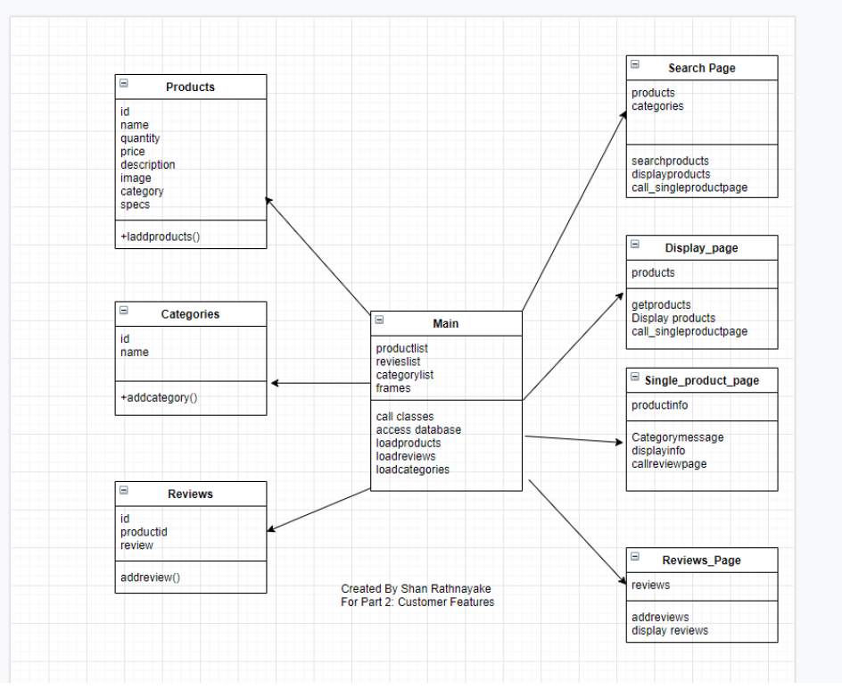

# myFirstPythonProject

## The main objectives of the project
The project's idea is to learn various design and implementation methods such as OOP, abstraction, encapsulation, inheritance, and polymorphism. It does not to provide a specific application. In particular, the project is designed to explore OOP design's capabilities. 
However, to explore these programming concepts, an e-retails system for a toy shop is used. Note that the project is designed to explore the code rather than the application of it. For this reason, no effort has been made for the user interface design and for any additional functionality.

### Requirements of the System: 

•	ability to browse products.  
•	ability to search for products.   
•	ability to review products.  

### Functional Requirements of the system:

•	Code should be done in a OOP fashion.   
•	Code should contain a connection to the database.   
•	Code should contain a simple user interface (No design required)  

## Design of the system. 

## Disclaimer - 
I created the work presented above as part of the assessment process at the University of Greenwich. 
It should be noted that this work should not be submitted or presented as an original piece for current or future academic 
assignments as it violates the integrity policies in the technical or educational industry. 

Additionally, it should be noted that even though diligence efforts have been made to make the code as accurate as possible,
there is still a possibility for errors. 

Please feel free to comment, provide ideas, discussions and point out any information regarding the code.

you can contact me through - https://www.linkedin.com/in/shan-rathnayake/

Thank you. 
